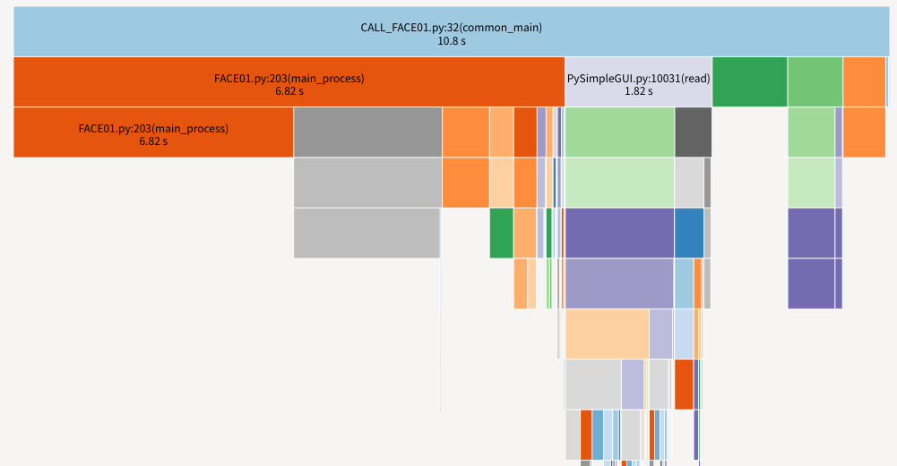
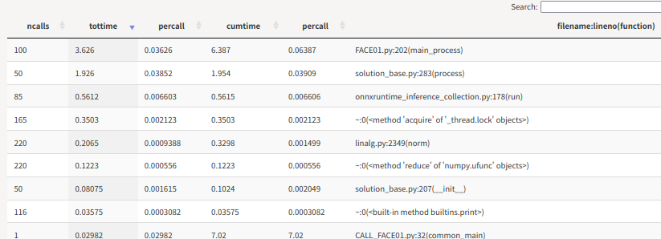

<!--  
- 最終更新日
- 
  -->
# 一時的なコード秘匿にCythonを！

# 環境
Cython==0.29.30
# Cythonをコード秘匿に使う
Cythonについての記事を観察していると公式例の高速化手法を紹介していることが多い印象です。
Python高速化の需要は多いですが、この記事では**秘匿化とそれに伴う低速化**について取り上げます。
結論はCythonサイコー、なのですが、理由は**秘匿の手軽さ**に尽きます。
以下にその論拠や手法を記します。

> このドキュメントでは[FACE01](https://github.com/yKesamaru/FACE01_SAMPLE)を例にします。
> FACE01はPythonから利用する多機能な顔認識ライブラリです。

## ソースコードの秘匿手法
Pythonにおけるソースコード秘匿手法について調べると、クラウドでやれ、とかPyArmorを使えと出てきます。
クラウドを利用する方法はここでは触れないとして、PyArmorも選択肢から外します。

CythonはそのままのPythonファイルをバイナリ化出来ます。下記は実際のsoファイルを逆アセンブルした様子です。
```bash:逆アセンブル例
objdump -S logger.cpython-38-x86_64-linux-gnu.so 

logger.cpython-38-x86_64-linux-gnu.so:     ファイル形式 elf64-x86-64


セクション .init の逆アセンブル:

0000000000003000 <_init>:
    3000:	f3 0f 1e fa          	endbr64 
    3004:	48 83 ec 08          	sub    $0x8,%rsp
    3008:	48 8b 05 79 9f 00 00 	mov    0x9f79(%rip),%rax        # cf88 <__gmon_start__>
    300f:	48 85 c0             	test   %rax,%rax
    3012:	74 02                	je     3016 <_init+0x16>
    3014:	ff d0                	callq  *%rax
    3016:	48 83 c4 08          	add    $0x8,%rsp
    301a:	c3                   	retq   

セクション .plt の逆アセンブル:

0000000000003020 <.plt>:
    3020:	ff 35 e2 9f 00 00    	pushq  0x9fe2(%rip)        # d008 
# 以降省略
```


## コード変更頻度
元のPythonファイルに変更が生じるたびに、別に存在する高速化コードも変更しなくてはいけないと非常に面倒くさいです。
Pythonとして実行できるファイルが少ない手間でバイナリ化出来ると効率的ですね。
ですのでCythonを使うと言っても後から編集しなくてはいけないファイルは使用しません。

## 高速化手法との違い
Pythonで書かれたコードを高速化する場合、どこがボトルネックになっているかプロファイルしてから要所のみを変更します。
ここで扱う秘匿化と高速化は異なります。
手軽な秘匿化は低速化をもたらします。

この記事ではどの程度低速化してしまうかプロファイルします。

### プロファイル手法
cProfileとそれをブラウザで可視化するsnakeviz、細かい箇所は`time.perf_counter()`を用います。
また変換後のプロファイルを得るために
```python
#cython: profile=True
```
を先頭行付近に配置します。詳細は[こちら](https://cython.readthedocs.io/en/stable/src/tutorial/profiling_tutorial.html#enabling-profiling-for-a-complete-source-file)を参照してください。

これらのスニペットを挟むことにより尚更低速化が起こります。わかりやすさのために挿入しているということです。

## テストコード
ディレクトリ構成や出来ることは[こちら](https://github.com/yKesamaru/FACE01_SAMPLE)を参照してください。

```python
import cProfile as pr
import PySimpleGUI as sg
import cv2
import time
from face01lib.video_capture import VidCap
VidCap_obj = VidCap()
from face01lib.Core import Core
Core_obj = Core()
from sys import exit

import FACE01 as fg

"""DEBUG
Set the number of playback frames"""
exec_times: int = 30
ALL_FRAME = exec_times

# PySimpleGUI layout
sg.theme('LightGray')
if fg.args_dict["headless"] == False:
    layout = [
        [sg.Image(filename='', key='display', pad=(0,0))],
        [sg.Button('terminate', key='terminate', pad=(0,10), expand_x=True)]
    ]
    window = sg.Window(
        'FACE01 EXAMPLE', layout, alpha_channel = 1, margins=(10, 10),
        location=(0,0), modal = True, titlebar_icon="./images/g1320.png", icon="./images/g1320.png"
    )

def common_main(exec_times):
    profile_HANDLING_FRAME_TIME_FRONT = time.perf_counter()
    event = ''
    while True:
        try:
            frame_datas_array = fg.main_process().__next__()
        except Exception as e:
            print(e)
            exit(0)
        exec_times = exec_times - 1
        if  exec_times <= 0:
            break
        else:
            print(f'exec_times: {exec_times}')
            if fg.args_dict["headless"] == False:
                event, _ = window.read(timeout = 1)
                if event == sg.WIN_CLOSED:
                    print("The window was closed manually")
                    break
            for frame_datas in frame_datas_array:
                if "face_location_list" in frame_datas:
                    img, face_location_list, overlay, person_data_list = \
                        frame_datas['img'], frame_datas["face_location_list"], frame_datas["overlay"], frame_datas['person_data_list']
                    for person_data in person_data_list:
                        if len(person_data) == 0:
                            continue
                        name, pict, date,  location, percentage_and_symbol = \
                            person_data['name'], person_data['pict'], person_data['date'],  person_data['location'], person_data['percentage_and_symbol']
                        if name != 'Unknown':
                            result, score, ELE = Core_obj.return_anti_spoof(frame_datas['img'], person_data["location"])
                            if fg.args_dict["anti_spoof"] is True:
                                if ELE is False:
                                    print(
                                        name, "\n",
                                        "\t", "Anti spoof\t\t", result, "\n",
                                        "\t", "Anti spoof score\t", round(score * 100, 2), "%\n",
                                        "\t", "similarity\t\t", percentage_and_symbol, "\n",
                                        "\t", "coordinate\t\t", location, "\n",
                                        "\t", "time\t\t\t", date, "\n",
                                        "\t", "output\t\t\t", pict, "\n",
                                        "-------\n"
                                    )
                            else:
                                if ELE is False:
                                    print(
                                        name, "\n",
                                        "\t", "similarity\t\t", percentage_and_symbol, "\n",
                                        "\t", "coordinate\t\t", location, "\n",
                                        "\t", "time\t\t\t", date, "\n",
                                        "\t", "output\t\t\t", pict, "\n",
                                        "-------\n"
                                    )
                    if fg.args_dict["headless"] == False:
                        imgbytes = cv2.imencode(".png", img)[1].tobytes()
                        window["display"].update(data = imgbytes)
        if fg.args_dict["headless"] == False:
            if event =='terminate':
                break
    if fg.args_dict["headless"] == False:
        window.close()
    
    profile_HANDLING_FRAME_TIME_REAR = time.perf_counter()
    profile_HANDLING_FRAME_TIME = (profile_HANDLING_FRAME_TIME_REAR - profile_HANDLING_FRAME_TIME_FRONT) 
    print(f'Predetermined number of frames: {ALL_FRAME}')
    print(f'Number of frames processed: {ALL_FRAME - exec_times}')
    print(f'Total processing time: {round(profile_HANDLING_FRAME_TIME , 3)}[seconds]')
    print(f'Per frame: {round(profile_HANDLING_FRAME_TIME / (ALL_FRAME - exec_times), 3)}[seconds]')
pr.run('common_main(exec_times)', 'restats')
```

上記サンプルプログラムは30frame処理すると終了します。
終了した時点で
```bash
snakeviz restats 
```
を実行するとサーバが立ち上がって下記がブラウザに表示されます。バーをクリックすることで絞り込み可能で、テーブルの並び替えも出来る高性能なモジュールです。





# `Pure Python Mode`を利用
公式ドキュメントは[こちら](https://cython.readthedocs.io/en/stable/src/tutorial/pure.html)です。

公式ドキュメントに書いてあるとおりいくつかのやり方が存在しますが、目的が面倒くささの排除ですので、`pxd`ファイルを作る方向はなしにします。
`magic cython module`を使いましょう。

## 呼び出し側コード
```python
    def r_face_image(self, frame, face_location):
        self.frame = frame
        self.face_location = face_location
        face_image = Return_face_image().return_face_image(self.frame, self.face_location)
        return face_image
```

## Pythonコード
```python
from __future__ import annotations
import numpy as np

class Return_face_image():
    def return_face_image(
        self,
        resized_frame,
        face_location: tuple
    ):
        """Return face image array which contain ndarray

        Args:
            resized_frame (numpy.ndarray): frame data
            face_location (tuple): face location which ordered top, right, bottom, left

        Returns:
            list: face image of ndarray or empty array
        """        
        self.resized_frame = resized_frame
        empty_ndarray = \
            np.empty(shape=(2,2,3), dtype=np.uint8)
        self.face_location: tuple = face_location

        if len(self.face_location) > 0:
            top: int = face_location[0]
            right: int = face_location[1]
            bottom: int = face_location[2]
            left: int = face_location[3]
            face_image = self.resized_frame[top:bottom, left:right]
            """DEBUG
            from face01lib.video_capture import VidCap
            VidCap().frame_imshow_for_debug(face_image)
            VidCap().frame_imshow_for_debug(self.resized_frame)
            """
            return face_image
        else:
            return empty_ndarray
```
## Pythonコード + Pure Python Mode (Cython)
```python
# 追加・変更可能部分

#cython: language_level=3
#cython: profile=True
""" これらは使用しません
# cython: boundscheck = False
# cython: wraparound = False
# cython: initializedcheck = False
# cython: cdivision = True
# cython: always_allow_keywords = False
# cython: unraisable_tracebacks = False
# cython: binding = False
"""

"""cythonでは使用不可
from __future__ import annotations
"""
def return_face_image(
    ...

    if len(self.face_location) > 0:
        top: cython.int = face_location[0]
        right: cython.int = face_location[1]
        bottom: cython.int = face_location[2]
        left: cython.int = face_location[3]
        face_image: np.ndarray = self.resized_frame[top:bottom, left:right]
```

追加・変更部分は非常に少ないです。
`int`は`cython.int`に変更。

### コンパイルコード
```python
from setuptools import setup
from Cython.Build import cythonize
import glob

py_file_list = glob.glob('~/bin/FACE01/face01lib/pyx/*pyx')
for pyfile in py_file_list:
    setup(
        ext_modules = cythonize(
            pyfile,
        )
    )
```

## C++コード (Pybind11使用)
仮に全く別のコードを書いてみたらどうでしょう。C++で書いてみます。
```Cpp
#include <iostream>
#include <pybind11/pybind11.h>
#include <pybind11/numpy.h>
/*
https://pybind11.readthedocs.io/en/stable/advanced/pycpp/numpy.html?highlight=numpy#numpy
https://stackoverflow.com/questions/61821844/how-to-express-thisa03-03-in-python-as-cpybind11
*/
namespace py = pybind11;
    
class Return_face_image
{
public:
    // コンストラクタ
    Return_face_image(){}

    py::array_t<uint8_t> return_face_image(
        const py::array resized_frame,
        const std::tuple<int, int, int, int> &face_location)
    {
        int top = std::get<0>(face_location);
        int right = std::get<1>(face_location);
        int bottom = std::get<2>(face_location);
        int left = std::get<3>(face_location);
        int step = 1;

        py::array face_image = 
        resized_frame[py::make_tuple( py::slice(top,bottom, step), py::slice(left,right,step),py::slice(0,3, step))];

        return face_image;
    }
};

PYBIND11_MODULE(return_face_image, m)
{
    py::class_<Return_face_image>(m, "Return_face_image")
        .def(py::init<>())
        .def(
            "return_face_image",
            &Return_face_image::return_face_image)
        .def("__init__", [](const Return_face_image &)
             { return "<Return_face_image>"; });
};
```

### コンパイルコード
```python
from setuptools import setup
from pybind11.setup_helpers import Pybind11Extension, build_ext

ext_modules = \
    [Pybind11Extension(
        "return_face_image",
        ["./return_face_image.cpp"]
    )]

setup(
    cmdclass={"build_ext": build_ext},
    ext_modules = ext_modules
)
```

# 速度計測結果
## 出力
```bash
Audrey Hepburn 
         Anti spoof              real 
         Anti spoof score        99.0 %
         similarity              99.2% 
         coordinate              (127, 403, 324, 206) 
         time                    2022,08,20,23,05,42,579428 
         output                   
 -------

Audrey Hepburn 
         Anti spoof              real 
         Anti spoof score        99.0 %
         similarity              99.2% 
         coordinate              (127, 403, 324, 206) 
         time                    2022,08,20,23,05,42,592691 
         output                  output/Audrey Hepburn_2022,08,20,23,05,42,597155_0.36.png 
 -------
```


## Python
```bash
Predetermined number of frames: 50
Number of frames processed: 50
Total processing time: 11.895[seconds]
Per frame: 0.238[seconds]
```


## Cython
```bash
Predetermined number of frames: 50
Number of frames processed: 50
Total processing time: 11.678[seconds]
Per frame: 0.234[seconds]
```


## Cpp
```bash
Predetermined number of frames: 50
Number of frames processed: 50
Total processing time: 11.879[seconds]
Per frame: 0.238[seconds]
```


## 処理速度
